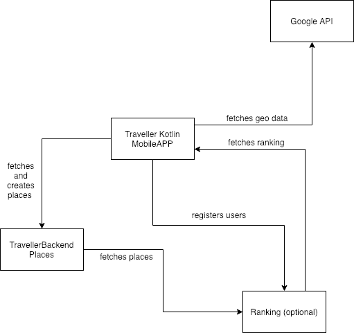

## Traveller

Traveller is a mobile web application written in Kotlin which allows to discover a new places all around the world.

### Details

Traveller uses the geolocation from the Google maps to find the user's phone location and it shows the nearest places to visit.

Place consist of any number of Points and should be located near them. Place point should be used as the start/main point of the points group.

The list of the available places is fetched from the [TravellerBackend](https://github.com/polskikiel/travellerbackend) application, as a JSON objects in the following format:

`Place`:

| Parameter   |      Mandatory      |  Description |
|:----------:|:-------------:|:------|
| **data** |    **YES**   | Specifies the base Point for that Place. |
| **data.x** |    **YES**   | Defines the X localization of the Place. |
| **data.y** |    **YES**   | Defines the Y localization of the Place. |
| **data.name** |    **YES**   | Defines the name of the Place, must be unique. |
| **data.description** |    **NO**   | Defines the description of the Place.. |
| **data.img** |    **NO**   | Provides an URL to the image showing the Place. |
| **points** |    **NO**   | Points to explore within the Place scope. |

`Point`:

| Field           |Mandatory|  Description |
|:---------------:|:-------:|:-------------|
| **x**           | **YES** | Defines the X localization of the Point.        |
| **y**           | **YES** | Defines the Y localization of the Point.        |
| **name**        | **YES** | Defines the name of the Point, must be unique.  |
| **description** | **NO**  | Defines the description of the Point.           |
| **img**         | **NO**  | Provides an URL to the image showing the Point. |

### Architecture

You can meet the Traveller architecture with the following graph:

  

### Configuration

To configure the Traveller you must run it on your phone or the emulation and simultaneously run the TravellerBackend application on your localhost.

By default Traveller will try to fetch the places from the following [endpoint](http://localhost:8080/places).
